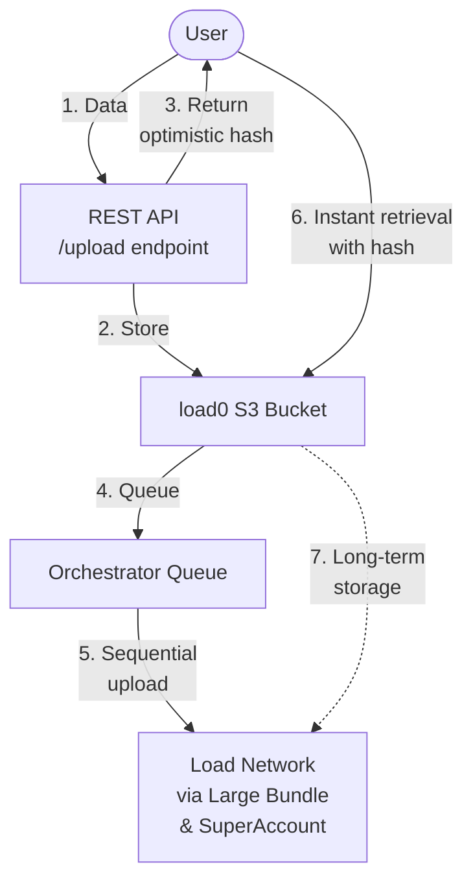

<p align="center">
  <a href="https://load.network">
    
  </a>
</p>


## About

`load0` is Bundler's [Large Bundle](https://github.com/weaveVM/bundler?tab=readme-ov-file#large-bundle) on steroids -- a cloud-like experience to upload and download data from [Load Network](https://docs.load.network) using the Bundler's `0xbabe2` transaction format powered with [SuperAccount](https://github.com/weaveVM/bundler?tab=readme-ov-file#superaccount) & S3 under the hood.

## Technical Architecture

First, the user sends data to the load0 REST API `/upload` endpoint -- the data is pushed to load0's S3 bucket and returns an optimistic hash (keccak hash) which allows the users to instantly retrieve the object data from load0.

After being added to the load0 bucket, the object gets added to the orchestrator queue that uploads the optimistic cached objects to Load Network. Using Large Bundle & SuperAccount, the S3 bucket objects get sequentially uploaded to Load and therefore, permanently stored while maintaining very fast uploads and downloads.



## REST API

### 1- Upload object

```bash
curl -X POST "https://load0.load.rs/upload" \
     --data-binary "@./video.mp4" \
     -H "Content-Type: video/mp4"
```
### 2- Download object (browser)

```bash
GET https://load0.load.rs/download/{optimistic_hash}
```

Also, to have endpoints similiarity as in `bundler.load.rs`, you can do:

```bash
GET https://load0.load.rs/resolve/{optimistic_hash}
```

### 3- Retrieve Bundle metadata using optimistic hash or bundle txid (once settled)

```bash
GET https://load0.load.rs/bundle/optimistic/{op_hash}
```

```bash
GET https://load0.load.rs/bundle/load/{bundle_txid}
```

Returns:

```rust
pub struct Bundle {
    pub id: u32,
    pub optimistic_hash: String,
    pub bundle_txid: String,
    pub data_size: u32,
    pub is_settled: bool,
}
```

An object data can be accessed via:

* optimistic caching: `https://load0.load.rs/resolve/{Bundle.optimistic_hash}`
* from Load Network (once settled): `https://bundler.load.rs/v2/resolve/{Bundle.bundle_txid}`

## License
This project is licensed under the [MIT License](./LICENSE)